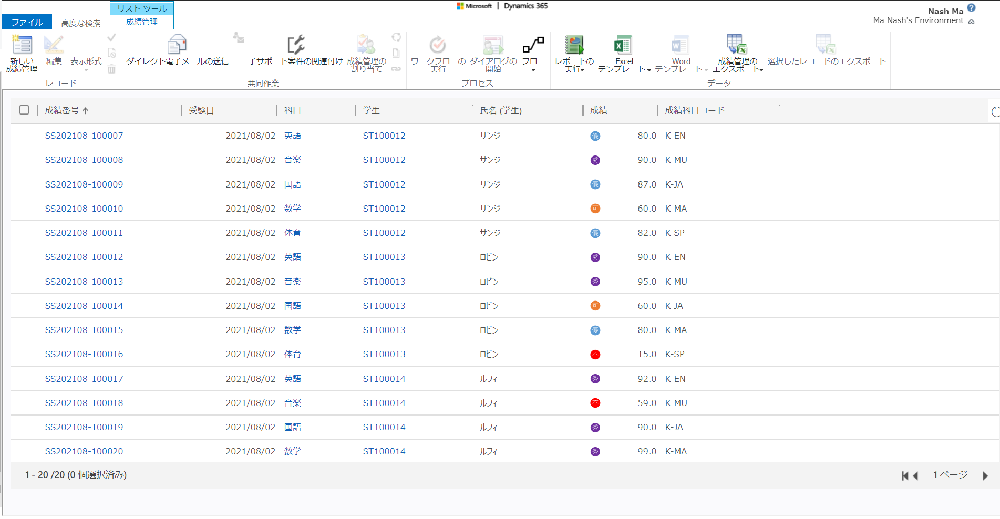

# D365Script.DisplayIconTooltip
How to add icons and tooltips to a list view 
Dynamics365のビューにアイコンとツールチップを追加する。

### 下記の通りにビュー一覧で成績によってアイコンとツールチップを表示させる。
| 成績| アイコン | ツールチップ |
:----|:---:|:----
| 100～90点 | 秀 | 大変優秀な成績です。 |
| 89～80点 | 優 | 優秀な成績です。 |
| 79～70点 | 良 | 平均的な成績です。 |
| 69～60点 | 可 | 努力を要する成績です。 |
| 59点以下 | 不 | より一層の努力を要する成績です。 |

#### ■結果（PC版Webブラウザ）
###### ①アイコンの表示👇　   
###### ①高度な検索のビューでアイコンの表示👇　   
###### ②ツールチップの表示👇　   

#### ■結果（モバイルアプリDynamics365）
###### ①Android端👇　   
###### ①iPhone端👇　   

#### ■参考：
[リスト ビューにユーザー定義アイコンを表示](https://docs.microsoft.com/ja-jp/dynamics365/customerengagement/on-premises/customize/display-custom-icons-instead?view=op-9-1)
